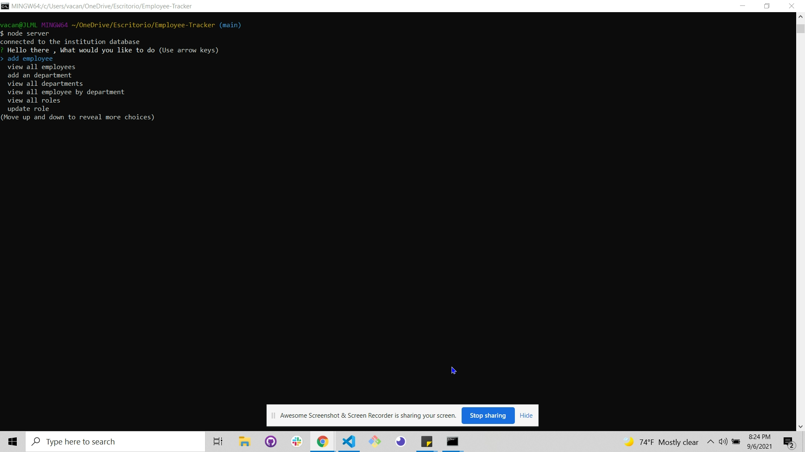
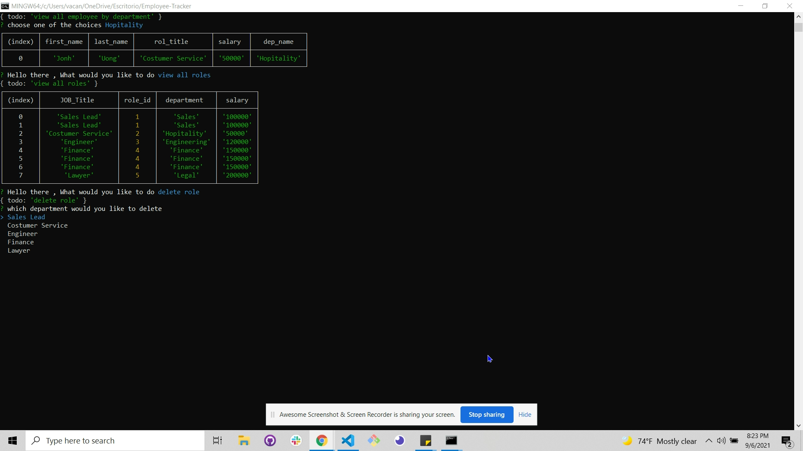

 
  <br/>
  <br/>
  
  <div align="center">
  
  <h1>  Employee_Tracker_Aplication <br> </h1>
  <h2 >E_T_A</h2>

  <br/>
  <a href="#about"><strong>Explore the screenshots »</strong></a>
  <br/>
  <br/>
  
  </div>
  
  
  
  <div align="center">
  <br/>
  
  [](https://github.com/mejialaguna/Employee_Tracker_Aplication)[](https://opensource.org/licenses/MPL-2.0)
    
  </div>
  
  <br/>
  
  <details open="open">
  <summary>Table of Contents</summary>
  
  - [About](#about)
  - [Built With](#built-with)
  - [Installation](#installation)
  - [Authors & contributors](#authors--contributors)
  - [Acknowledgements](#Acknowledgements)
  - [License](#License) 
  
  </details>  
  
  <br/>
  
  ## About
  ---

  <br/>

  This application is designed to add , update and remove employees ,departments and assign roles to all employees inside of a company . 
  
  <br/>
  <br/>

  <details open="open">
  <summary>Usage Screenshots and Demo</summary>

  <br/> 
  
   
  
  

  <br>
  <br>

  please to watch the A walkthrough video demonstrating the functionality of the application. <a href= "https://drive.google.com/file/d/11GBPvn26WUECgwKdOdPAMBkYycIm1SlL/view">click here </a>
  
  </details>
  
  <br/>
  <br/>
  
  
  ## Built With
  ---

  <br/>

 
 >*  <a href="https://developer.mozilla.org/en-US/docs/Mozilla/Add-ons/WebExtensions/API">JavaScript</a>
 >*  <a href="https://nodejs.org/en/">Node</a>
 >*  <a href="https://www.w3schools.com/js/js_es6.asp">ES6</a>
 >*  <a href="https://www.npmjs.com/package/inquirer">INQUIRER</a>
 >*  <a href="https://www.npmjs.com/package/mysql2">Node MySQL 2</a>
  
  
  <br/>
  <br/>
  
  ##  Installation
  ---

  <br/>
  
   1. Install node js <a href="https://nodejs.org/en/"> [ HERE ]</a>. 
   2. Install Inquirer Dependency <a href="https://www.npmjs.com/package/inquirer">[ Read Documentation here ]</a>.
   2. Install Node MySQL 2 Dependency <a href="https://www.npmjs.com/package/mysql2">[ Read Documentation here ]</a>.
   3. Clone this https://github.com/mejialaguna/Employee_Tracker_Aplication/issues/1.
   4. Run node server inside your terminal. 
   5. Answer all the question and start building you company.
   7. Enjoy.

  <br/>
  <br/>
  
  
  ##  Authors & contributors
  ---

  <br/>
   
  Jose Luis Mejia Laguna.
  
  <br/>
  <br/>
  
  ## Acknowledgements
  ---

  <br/>

  First off , thanks for taking the time to check out my app! , contribution are what make this open-source community such an amazing place to learn , inspire and create. Any contribution you make will benefit everyone interested in using the app and are very appriciated.
  ---

  <br/>
  <br/>
  
  ## License
  ---
  <br/>

  [](https://opensource.org/licenses/MPL-2.0)

  <br/>

  
  
  <a href="https://github.com/mejialaguna/Employee_Tracker_Aplication/issues/1">For any Question and to point out a bug please click here...</a>
  

## Acceptance Criteria

```md
GIVEN a command-line application that accepts user input
WHEN I start the application
THEN I am presented with the following options: view all departments, view all roles, view all employees, add a department, add a role, add an employee, and update an employee role
WHEN I choose to view all departments
THEN I am presented with a formatted table showing department names and department ids
WHEN I choose to view all roles
THEN I am presented with the job title, role id, the department that role belongs to, and the salary for that role
WHEN I choose to view all employees
THEN I am presented with a formatted table showing employee data, including employee ids, first names, last names, job titles, departments, salaries, and managers that the employees report to
WHEN I choose to add a department
THEN I am prompted to enter the name of the department and that department is added to the database
WHEN I choose to add a role
THEN I am prompted to enter the name, salary, and department for the role and that role is added to the database
WHEN I choose to add an employee
THEN I am prompted to enter the employee’s first name, last name, role, and manager and that employee is added to the database
WHEN I choose to update an employee role
THEN I am prompted to select an employee to update and their new role and this information is updated in the database 
```

